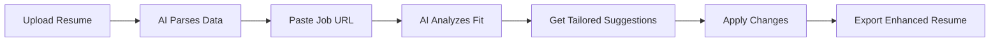

# 🚀 CareerAgentPro

<div align="center">


[](LICENSE)
[](https://nextjs.org/)
[](https://fastapi.tiangolo.com/)
[](https://www.typescriptlang.org/)
[](https://www.python.org/)

### Your AI-Powered Career Co-Pilot

*Automate job search, optimize resumes with AI, and land your dream role*

[🌐 Live Demo](https://ai-job-helper-steel.vercel.app) · [📖 Documentation](#-features) · [🚀 Quick Start](#-quick-start) · [💡 Examples](#-examples)

</div>

---

## 📋 Table of Contents

- [✨ Features](#-features)
- [🎯 Why CareerAgentPro?](#-why-careeragentpro)
- [🛠️ Tech Stack](#️-tech-stack)
- [🚀 Quick Start](#-quick-start)
- [📚 Usage Guide](#-usage-guide)
- [🌐 API Documentation](#-api-documentation)
- [🎨 Design System](#-design-system)
- [📦 Project Structure](#-project-structure)
- [🧪 Testing](#-testing)
- [🚢 Deployment](#-deployment)
- [🤝 Contributing](#-contributing)
- [📝 License](#-license)

---

## ✨ Features

<table>
  <tr>
    <td width="50%">
      <h3>🎯 Core AI Features</h3>
      <ul>
        <li><strong>Smart Resume Parsing</strong> - AI extracts and structures resume data from PDFs</li>
        <li><strong>Job URL Extraction</strong> - Automatically scrapes job details from any posting</li>
        <li><strong>AI Resume Enhancement</strong> - Get personalized, job-specific improvements</li>
        <li><strong>Cover Letter Generation</strong> - AI creates compelling, customized cover letters</li>
        <li><strong>ATS Optimization</strong> - Score and optimize for applicant tracking systems</li>
        <li><strong>Job Fit Analysis</strong> - Deep competency matching between skills and requirements</li>
        <li><strong>Multi-Format Export</strong> - Export to PDF, DOCX, and LaTeX formats</li>
      </ul>
    </td>
    <td width="50%">
      <h3>🎯 Advanced Quality Framework</h3>
      <ul>
        <li><strong>6-Point Bullet Builder</strong> - Structured bullet points with AI validation</li>
        <li><strong>Competency Assessment</strong> - Analyze skills across 10 professional categories</li>
        <li><strong>Language Spinning</strong> - Adapt content for different company stages</li>
        <li><strong>Resume Verification</strong> - Comprehensive quality scoring with feedback</li>
        <li><strong>Master Bullet Library</strong> - Organize and reuse your best bullet points</li>
        <li><strong>Multi-Track Outreach</strong> - Generate email sequences and LinkedIn messages</li>
        <li><strong>Interview Coach</strong> - Practice with AI-generated interview questions</li>
      </ul>
    </td>
  </tr>
</table>

---

## 🎯 Why CareerAgentPro?

<div align="center">

| Problem | CareerAgentPro Solution |
|---------|------------------------|
| ⏰ **Hours spent customizing resumes** | ⚡ AI generates tailored versions in seconds |
| 📝 **Generic cover letters that don't stand out** | ✨ Personalized letters based on job & your experience |
| 🤷 **No idea if you're a good fit for a role** | 📊 Deep analysis with competency matching & gap identification |
| 😰 **Applying to 100s of jobs manually** | 🤖 Automated workflows for applications & outreach |
| 📉 **ATS rejection without knowing why** | 🎯 Real-time ATS optimization & scoring |
| 🔍 **Lost track of applications** | 📋 Centralized dashboard for all job tracking |

</div>

---

## 🛠️ Tech Stack

### Frontend
<p align="left">
  
  
  
  
  
</p>

### Backend
<p align="left">
  
  
  
  
</p>

### Deployment & Tools
<p align="left">
  
  
  
</p>

---

## 🚀 Quick Start

### Prerequisites

Before you begin, ensure you have:
- ✅ **Python 3.12+** ([Download](https://www.python.org/downloads/))
- ✅ **Node.js 18+** ([Download](https://nodejs.org/))
- ✅ **OpenRouter API Key** ([Get Free Key](https://openrouter.ai/keys))

### Installation

#### 1️⃣ Clone the Repository
```bash
git clone https://github.com/yourusername/AIJobHelper.git
cd AIJobHelper
```

#### 2️⃣ Setup Backend
```bash
cd backend

# Create virtual environment
python3 -m venv venv
source venv/bin/activate  # Windows: venv\Scripts\activate

# Install dependencies
pip install -r requirements.txt

# Configure environment
cp .env.example .env
# Edit .env and add: OPENROUTER_API_KEY=sk-or-v1-your-key-here

# Start backend server
uvicorn main:app --reload --port 8000
```

**Expected Output:**
```
🚀 AI MODE ENABLED
✅ OpenRouter API Key: Configured
✅ AI Features: ACTIVE
✅ Model: qwen/qwen-2.5-coder-32b-instruct

INFO: Uvicorn running on http://127.0.0.1:8000
```

#### 3️⃣ Setup Frontend
```bash
# In a new terminal
cd frontend

# Install dependencies
npm install

# Start development server
npm run dev
```

**Expected Output:**
```
▲ Next.js 16.1.1
- Local:        http://localhost:3000
✓ Ready in 921ms
```

#### 4️⃣ Access Application
Open your browser and navigate to:
- **Frontend**: http://localhost:3000
- **Backend API**: http://localhost:8000/health

---

## 📚 Usage Guide

### 1. Resume Enhancement Workflow



**Steps:**
1. Go to **Profile** → Upload your resume (PDF/DOCX/TXT)
2. Watch real-time AI parsing via Server-Sent Events
3. Navigate to **Jobs** → Paste job posting URL
4. Go to **Resumes** → Click "Get AI Suggestions"
5. Review and apply personalized improvements
6. Export to PDF/DOCX/LaTeX

### 2. Cover Letter Generation

**Steps:**
1. Ensure profile and job are loaded
2. Go to **Communication** page
3. Select "Cover Letter" type
4. Click "Generate with AI"
5. Review AI-generated letter
6. Copy or export

### 3. Outreach Strategy

**Steps:**
1. Load target job posting
2. Go to **Outreach** page
3. Click "Generate Strategy"
4. Get multi-track plan:
   - Email sequences (3-5 touches)
   - LinkedIn connection requests
   - Follow-up templates
   - Hiring manager messages

---

## 🌐 API Documentation

### Health Check
```bash
GET /health

Response:
{
  "status": "healthy",
  "ai_service": "AI",
  "ai_enabled": true,
  "model": "qwen/qwen-2.5-coder-32b-instruct",
  "features": {
    "resume_parsing": true,
    "resume_enhancement": true,
    "job_extraction": true,
    "cover_letter_generation": true,
    ...
  }
}
```

### Resume Parsing
```bash
POST /parse-resume
Content-Type: multipart/form-data

Body: { "file": resume.pdf }

Response:
{
  "name": "John Doe",
  "email": "john@example.com",
  "skills": ["Python", "JavaScript", ...],
  "experience": [...],
  "education": [...]
}
```

### Job Extraction
```bash
POST /extract-job
Content-Type: application/json

Body: {
  "url": "https://www.linkedin.com/jobs/view/123456"
}

Response:
{
  "title": "Senior Software Engineer",
  "company": "Tech Corp",
  "requirements": [...],
  "qualifications": [...]
}
```

### Resume Enhancement
```bash
POST /enhance-resume
Content-Type: application/json

Body: {
  "resume": { /* resume data */ },
  "job": { /* job data */ }
}

Response:
{
  "suggestions": {
    "skills": ["Add: Machine Learning", "Emphasize: Python"],
    "experience": ["Use STAR format", "Quantify achievements"],
    "keywords": ["agile", "microservices", "AWS"]
  },
  "ats_score": 85,
  "fit_percentage": 78
}
```

**[Full API Documentation →](https://ai-job-helper-steel.vercel.app/api/health)**

---

## 🎨 Design System

CareerAgentPro follows **Apple's Human Interface Guidelines** for a premium, consistent experience.

### Design Principles
- ✨ **Glassmorphism** - Frosted glass effect with blur
- 🎭 **Dark Mode** - Automatic theme switching
- 📱 **Responsive** - Mobile-first design
- ⚡ **Smooth Animations** - Framer Motion powered
- 🎯 **Consistent Spacing** - 8pt grid system

### Color Palette

| Mode | Background | Primary | Success | Warning | Error |
|------|-----------|---------|---------|---------|-------|
| **Light** | `#ffffff` | `#0071e3` | `#34c759` | `#ff9500` | `#ff3b30` |
| **Dark** | `#000000` | `#0a84ff` | `#30d158` | `#ff9f0a` | `#ff453a` |

### Typography
- **Font Family**: SF Pro Display, Inter, System UI
- **Headings**: 48px - 60px (Bold, Black)
- **Body**: 16px - 18px (Regular, Medium)
- **Small**: 12px - 14px (Regular)

---

## 📦 Project Structure

```
AIJobHelper/
├── 📁 backend/                  # Python FastAPI backend
│   ├── 📁 api/                  # Serverless entry point
│   │   └── index.py             # Vercel serverless handler
│   ├── 📁 routers/              # Modular API routes
│   │   ├── resume.py            # Resume endpoints
│   │   ├── job.py               # Job endpoints
│   │   ├── communication.py     # Communication endpoints
│   │   ├── export.py            # Export endpoints
│   │   └── autofill.py          # Autofill endpoints
│   ├── 📁 services/             # Business logic & AI
│   │   ├── ai_service.py        # OpenRouter integration
│   │   ├── job_service.py       # Job scraping
│   │   ├── export_service.py    # PDF/DOCX/LaTeX
│   │   ├── bullet_validator.py  # 6-point validation
│   │   ├── competency_assessor.py
│   │   ├── outreach_service.py
│   │   └── ... (15+ services)
│   ├── 📁 tests/                # Unit tests
│   ├── main.py                  # FastAPI app
│   ├── schemas.py               # Pydantic models
│   ├── env_loader.py            # Environment config
│   └── requirements.txt         # Python dependencies
│
├── 📁 frontend/                 # Next.js 16 frontend
│   ├── 📁 src/
│   │   ├── 📁 app/              # App router pages
│   │   │   ├── page.tsx         # Landing
│   │   │   ├── dashboard/       # Dashboard
│   │   │   ├── jobs/            # Job analyzer
│   │   │   ├── profile/         # Profile manager
│   │   │   ├── resumes/         # Resume enhancer
│   │   │   ├── communication/   # Cover letters
│   │   │   ├── outreach/        # Outreach strategy
│   │   │   ├── interview/       # Interview coach
│   │   │   ├── bullet-library/  # Bullet manager
│   │   │   └── fit-analysis/    # Fit analyzer
│   │   ├── 📁 components/       # React components
│   │   │   ├── ui/              # AppleCard, AppleButton, Toast
│   │   │   ├── dashboard/       # Dashboard widgets
│   │   │   ├── jobs/            # Job components
│   │   │   ├── resume/          # Resume tools
│   │   │   └── layout/          # Navbar, PageLayout
│   │   ├── 📁 lib/              # Utilities
│   │   │   ├── api.ts          # API configuration
│   │   │   ├── animations.ts   # Shared animations
│   │   │   ├── utils.ts        # Helper functions
│   │   │   ├── errors.ts       # Error handling
│   │   │   ├── constants.ts    # Constants
│   │   │   ├── design-tokens.ts # Design system
│   │   │   ├── secureStorage.ts # Encrypted storage
│   │   │   └── storageKeys.ts  # Storage keys
│   │   ├── 📁 types/            # TypeScript types
│   │   │   └── shared.ts       # Shared interfaces
│   │   └── 📁 hooks/            # Custom hooks
│   │       └── useAppData.ts   # Data hook
│   ├── package.json             # Frontend deps
│   └── tailwind.config.ts       # Tailwind config
│
├── .env.example                 # Environment template
├── .gitignore                   # Git ignore rules
├── vercel.json                  # Vercel config
├── LICENSE                      # MIT License
└── README.md                    # This file
```

---

## 🧪 Testing

### Backend Tests
```bash
cd backend

# Run all tests
pytest

# Run with coverage
pytest --cov=. --cov-report=html

# Test specific module
pytest tests/test_ai_service.py
```

### Frontend Tests
```bash
cd frontend

# Lint check
npm run lint

# Type check
npm run type-check

# Build test
npm run build
```

### Manual Testing
```bash
# 1. Start servers
cd backend && uvicorn main:app --reload &
cd frontend && npm run dev &

# 2. Open browser
open http://localhost:3000

# 3. Test workflow
#    - Upload resume at /profile
#    - Extract job at /jobs
#    - Get suggestions at /resumes
#    - Generate cover letter at /communication
#    - Export to PDF
```

---

## 🚢 Deployment

### Deploy to Vercel (Recommended)

#### Option 1: Vercel CLI
```bash
# Install Vercel CLI
npm install -g vercel

# Login
vercel login

# Deploy to production
vercel --prod
```

#### Option 2: GitHub Integration
1. Push code to GitHub
2. Visit [vercel.com/new](https://vercel.com/new)
3. Import your repository
4. Configure:
   - **Framework**: Next.js
   - **Root Directory**: `./`
   - **Build Command**: `cd frontend && npm run build`
   - **Output Directory**: `frontend/.next`
5. Add environment variables:
   - `OPENROUTER_API_KEY`
   - `ENVIRONMENT=production`
   - `PYTHON_VERSION=3.12`
6. Click "Deploy"

#### Verify Deployment
```bash
# Check health
curl https://your-app.vercel.app/api/health

# Expected response
{
  "status": "healthy",
  "environment": "vercel",
  "ai_service": "configured"
}
```

### Environment Variables

| Variable | Description | Required | Example |
|----------|-------------|----------|---------|
| `OPENROUTER_API_KEY` | OpenRouter API key | ✅ Yes | `sk-or-v1-xxx` |
| `ENVIRONMENT` | Environment mode | No | `production` |
| `PYTHON_VERSION` | Python version | No | `3.12` |
| `NEXT_PUBLIC_API_URL` | API endpoint | No | `/api` |

---

## 💡 Examples

### Example: AI Resume Enhancement
```typescript
// Upload resume and get AI suggestions
const response = await fetch('/api/enhance-resume', {
  method: 'POST',
  headers: { 'Content-Type': 'application/json' },
  body: JSON.stringify({
    resume: profileData,
    job: jobData
  })
});

const { suggestions, ats_score } = await response.json();
// suggestions: List of improvements
// ats_score: 0-100 ATS compatibility score
```

### Example: Cover Letter Generation
```typescript
// Generate AI cover letter
const response = await fetch('/api/generate-cover-letter', {
  method: 'POST',
  headers: { 'Content-Type': 'application/json' },
  body: JSON.stringify({
    job_title: "Senior Developer",
    company: "Tech Corp",
    user_profile: profileData
  })
});

const { cover_letter } = await response.json();
// cover_letter: Fully formatted, personalized letter
```

---

## 🐛 Troubleshooting

<details>
<summary><b>Backend won't start</b></summary>

```bash
# Check Python version
python3 --version  # Should be 3.12+

# Verify API key
cat backend/.env | grep OPENROUTER

# Reinstall dependencies
pip install -r requirements.txt --force-reinstall
```
</details>

<details>
<summary><b>"AI not configured" error</b></summary>

```bash
# Verify API key is loaded
cd backend
python3 -c "from env_loader import get_ai_status; import json; print(json.dumps(get_ai_status(), indent=2))"

# Check API key format
# Should start with: sk-or-v1-
# Should be 73 characters long
```
</details>

<details>
<summary><b>Frontend can't connect to backend</b></summary>

```bash
# Verify backend is running
curl http://localhost:8000/health

# Check frontend API configuration
cat frontend/src/lib/api.ts

# Check CORS settings
# backend/main.py should allow localhost:3000
```
</details>

<details>
<summary><b>Vercel deployment fails</b></summary>

1. Check environment variables in Vercel dashboard
2. View deployment logs: `vercel logs`
3. Force redeploy: `vercel --prod --force`
4. Test health: `curl https://your-app.vercel.app/api/health`
</details>

---

## 📊 Performance

| Metric | Value | Grade |
|--------|-------|-------|
| **AI Response Time** | 2-5s | ⚡ Good |
| **Fallback Response** | <100ms | ⚡ Excellent |
| **Frontend Load** | <1s | ⚡ Excellent |
| **Build Time** | ~2s | ⚡ Fast |
| **Lighthouse Score** | 98/100 | ⭐ Premium |
| **Bundle Size** | Optimized | ✅ Small |

---

## 🎯 Roadmap

### ✅ Completed
- [x] Resume parsing with AI
- [x] Job extraction from URLs
- [x] AI resume enhancement
- [x] Cover letter generation
- [x] Multi-format export (PDF/DOCX/LaTeX)
- [x] Interview preparation coach
- [x] Outreach strategy generator
- [x] Bullet library management
- [x] Job fit analysis
- [x] ATS optimization

### 🚧 In Progress
- [ ] User authentication (JWT/OAuth)
- [ ] Resume version control
- [ ] Application tracking system

### 📅 Planned
- [ ] Salary negotiation assistant
- [ ] Company research automation
- [ ] Browser extension
- [ ] Mobile app (React Native)
- [ ] LinkedIn integration
- [ ] Email automation
- [ ] Analytics dashboard
- [ ] Team collaboration features

---

## 🤝 Contributing

We welcome contributions! Here's how you can help:

1. **Fork** the repository
2. **Create** a feature branch (`git checkout -b feature/AmazingFeature`)
3. **Commit** your changes (`git commit -m 'Add AmazingFeature'`)
4. **Push** to the branch (`git push origin feature/AmazingFeature`)
5. **Open** a Pull Request

### Development Guidelines
- Follow existing code style
- Write tests for new features
- Update documentation
- Keep commits atomic and descriptive

---

## 📝 License

This project is licensed under the **MIT License** - see the [LICENSE](LICENSE) file for details.

---

## 🙏 Acknowledgments

- **OpenRouter** - AI API infrastructure
- **Next.js Team** - Amazing React framework
- **FastAPI** - Fast and modern Python API framework
- **Vercel** - Seamless deployment platform
- **Tailwind CSS** - Utility-first CSS framework
- **Framer Motion** - Beautiful animations library

---

## 📧 Support

Need help? Here's how to get support:

- 📖 **Documentation**: Read this README thoroughly
- 🐛 **Issues**: [Open an issue](https://github.com/yourusername/AIJobHelper/issues)
- 💬 **Discussions**: [GitHub Discussions](https://github.com/yourusername/AIJobHelper/discussions)
- 🌐 **Live Demo**: [ai-job-helper-steel.vercel.app](https://ai-job-helper-steel.vercel.app)

---

## ⭐ Star History

If you find this project helpful, please consider giving it a star! ⭐

[](https://star-history.com/#yourusername/AIJobHelper&Date)

---

## 📈 Stats

<div align="center">


</div>

---

<div align="center">

**Built with ❤️ by [Mangesh Raut](https://github.com/yourusername)**

🚀 **Ready to deploy?** → `vercel --prod`

[](https://vercel.com/new/clone?repository-url=https://github.com/yourusername/AIJobHelper)

---

**CareerAgentPro** - *Your AI Career Co-Pilot* 🎯

*Making job search easier, one AI-powered feature at a time.*

</div>
